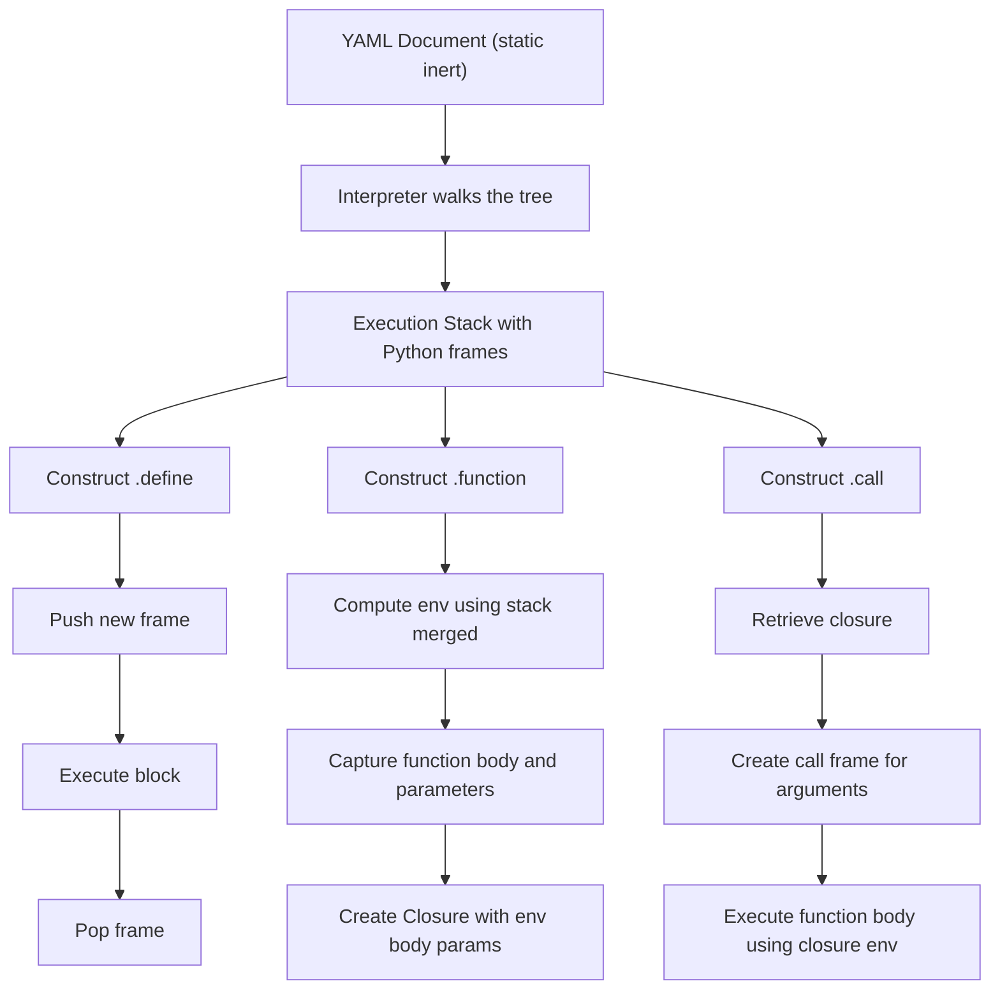

# YAMLpp Interpreter — Overview

PLEASE READ THIS DOCUMENT CAREFULLY

YAMLpp executes an inert YAML tree by walking it with a runtime evaluation stack. The YAML document itself contains no executable state; all execution semantics comes from the interpreter and its stack.

This description outlines the interpreter’s operational model, including the execution stack, name resolution, and the closure mechanism used by `.function`.

## The YAML Tree Is Inert

The YAML document is a static structure composed of mappings, sequences, scalars, and special constructs such as `.define`, `.function`, and `.call`.

None of these nodes carry runtime state. They do not store variables, environments, or closures. They are structural only. All execution state lives in the interpreter.

## The Execution Stack

To execute a YAML document, the interpreter walks the tree and maintains a stack of frames.  
Each frame is a Python dictionary mapping names to Python values:

- scalars  
- lists  
- dicts  
- Python functions  
- YAMLpp closures  

The stack represents the current execution environment. Name resolution is performed by merging the visible frames into a single flat environment.

### The `_merged()` Environment

At any point, the interpreter can compute the effective environment with:

```
merged = stack._merged()
```

`_merged()` returns a shallow copy of all visible bindings. It is not a lexical scope or a structural scope. It is simply the runtime environment that would be used if execution occurred at that moment.

This merged environment is the basis of YAMLpp’s closure model.

## The `.define` Construct

A `.define` introduces a new scope. Operationally:

- a new frame is pushed onto the stack  
- the block is executed  
- the frame is popped when the block ends  

Bindings created inside a `.define` are visible only while its frame is active.

## The `.function` Construct

A `.function` does not execute its body immediately. It creates a YAMLpp closure.

The guiding question is:

*What would the execution environment look like if the function body were executed right now?*

The answer is the result of `_merged()` at the point of definition.

### Diagram



### Closure Contents


> Dynamic vs Lexical Scope
> YAMLpp uses **dynamic-scope** capture of the context, not lexical capture.


A YAMLpp closure stores:

- `env` — the shallow merged environment at definition time  
- `body` — the YAML subtree representing the function body  
- `params` — the function’s parameter list  

The closure is a self‑contained execution unit. It does not capture lexical scope or frame hierarchy. It captures the dynamic execution environment at definition time. Because `_merged()` is shallow, references to mutable Python objects remain live.

## The `.call` Construct

When a `.call` is executed:

- the interpreter retrieves the closure  
- a new frame is created for the call’s arguments  
- the closure’s stored environment becomes the base environment  
- the function body is executed using that environment  

The closure’s environment is not recomputed. It is exactly the environment captured at definition time.

This ensures that functions see the environment they were defined in, that later changes to the stack do not affect existing closures, and that execution remains deterministic.

## Summary

- The YAML tree is static and inert.  
- Execution is driven by a stack of Python dictionaries.  
- `_merged()` produces the effective runtime environment.  
- `.define` manages scoped frames.  
- `.function` captures a closure consisting of the function body, parameters, and the merged environment at definition time.  
- `.call` executes the function body using the stored environment.

This model provides simple, predictable, and fully dynamic execution semantics for YAMLpp while leveraging Python’s runtime behavior for values and mutability.

If you want, I can help you refine this into a README section or split it into separate conceptual and operational documents.